# Sơ đồ quy trình BOHO Import Tool v2.1

> **Ngày:** 2026-08-03 | **Tool:** BOHO Import BOM/THDM v2.1

---

## Tổng quan 3 luồng chính

| Luồng | Người thực hiện | Tab trên Tool | Bước |
|-------|----------------|---------------|------|
| **A** | Anh Thái - NM | 🌳 Danh mục vật tư | B1 – B5 |
| **B** | Anh Dự - NM   | 📥 Import BOM       | B6 – B8 |
| **C** | Chị Thư - NM  | 📊 Tổng hợp định mức | B9 – B13 |

---

## Sơ đồ quy trình

```mermaid
%%{init: {"flowchart": {"htmlLabels": false, "curve": "basis"}, "theme": "base", "themeVariables": {"primaryColor": "#DBEAFE", "primaryBorderColor": "#1D4ED8", "secondaryColor": "#FEF9C3", "tertiaryColor": "#FCE7F3", "edgeLabelBackground": "#F8FAFC"}}}%%
flowchart LR

    %% ════════════════════════════════════════════════════════
    %% LUONG A — Danh muc vat tu (Anh Thai - NM) — B1–B5
    %% ════════════════════════════════════════════════════════
    subgraph LA["🗂️  LUỒNG A — Danh mục vật tư   Anh Thái - NM"]
        direction TB
        A0(["▶ Bắt đầu"])
        A0 --> B1["B1: Chọn nhóm NVL\ntrên Combobox\nBấm 'Xuất Template'"]
        B1 --> B1r(["📄 Output: File Excel mẫu .xlsx\n3 dòng header chuẩn"])
        B1r --> B2["B2: Mở Excel\nĐiền thông tin vật tư\n(Quy cách, Chất liệu, Cốt ván...)"]
        B2 --> B3["B3: Trên Tool\nBấm 'Chọn file Excel'\nchọn file vừa điền"]
        B3 --> AdF{"File đọc\nđược?"}
        AdF -- "❌ Sai format\nhoặc không mở được" --> AeF["⚠️ Báo lỗi:\nFile không đúng định dạng\nhoặc không đọc được"]
        AeF --> B3
        AdF -- "✅ Đọc OK" --> B3r2(["Dữ liệu hiển thị\ntrên màn hình Tool"])
        B3r2 --> B4["B4: Bấm 'Kiểm tra'\nTool validate toàn bộ dữ liệu"]
        B4 --> AdV{"Validate\nkết quả?"}
        AdV -- "❌ Lỗi:\nTrùng mã VT\nSai kiểu dữ liệu\nThiếu thông tin bắt buộc" --> AeV["⚠️ Hiển thị danh sách lỗi\nYêu cầu người dùng điều chỉnh"]
        AeV --> B2
        AdV -- "✅ Hợp lệ 100%\nKhông còn cảnh báo" --> B5["B5: Bấm 'Import vào BRAVO'\n(Chỉ khả dụng khi validate sạch)"]
        B5 --> A_END(["✅ Mã NVL được tạo trong BRAVO\nKiểm tra tại:\nDanh mục vật tư  hàng hóa"])
    end

    %% ════════════════════════════════════════════════════════
    %% LUONG B — Import BOM (Anh Du - NM) — B6–B8
    %% ════════════════════════════════════════════════════════
    subgraph LB["📦  LUỒNG B — Import BOM   Anh Dự - NM"]
        direction TB
        B_S(["▶ Bắt đầu"])
        B_S --> B6p["B6a: Bấm 'Chọn file Excel'\nChọn 'Mã nhân viên'"]
        B6p --> BdP{"File Excel\ncó mật khẩu?"}
        BdP -- "✅ Có password" --> BdlgP["🔐 Dialog:\nNhập mật khẩu Excel"]
        BdlgP --> BdPOK{"Mật khẩu\nchính xác?"}
        BdPOK -- "❌ Sai mật khẩu" --> BdlgP
        BdPOK -- "✅ Đúng" --> B6v
        BdP -- "❌ Không có password" --> B6v
        B6v["B6b: Bấm 'Kiểm tra'\nTool tự động:\n- Đọc & map Code → Id\n- Check trùng BOM ID\n- Check cột bắt buộc trống"]
        B6v --> BdV{"Validate\nkết quả?"}
        BdV -- "❌ Ô đỏ xuất hiện:\nMã chưa map được\nTrùng mã / Cột trống\nSai kiểu dữ liệu" --> BeV["⚠️ Grid hiển thị ô đỏ\n+ Chi tiết lỗi từng ô\nDữ liệu chưa đủ điều kiện import"]
        BeV --> B7["B7: Sửa lỗi\nTrực tiếp trên Excel\nhoặc chỉnh trong Tool"]
        B7 --> B6v
        BdV -- "✅ Sẵn sàng OK\nTất cả ô xanh" --> BdE{"BOM ID đã tồn tại\ntrong BRAVO?"}
        BdE -- "✅ Đã tồn tại" --> BeE["⚠️ Cảnh báo:\nBOM này đã có trong BRAVO\nGhi đè hay bỏ qua?"]
        BeE -- "❌ Hủy bỏ\n(không ghi đè)" --> B7
        BeE -- "✅ Xác nhận\nghi đè" --> B8
        BdE -- "❌ Chưa tồn tại" --> B8
        B8["B8: Bấm 'Import vào BRAVO'\n(Dữ liệu 100% hợp lệ)"]
        B8 --> B_END(["✅ BOM được import vào BRAVO\nKiểm tra tại:\nMục BOM trên BRAVO"])
    end

    %% ════════════════════════════════════════════════════════
    %% LUONG C — Tong hop dinh muc (Chi Thu - NM) — B9–B13
    %% ════════════════════════════════════════════════════════
    subgraph LC["📊  LUỒNG C — Tổng hợp định mức   Chị Thư - NM"]
        direction TB
        C_S(["▶ Bắt đầu"])
        C_S --> B9["B9: Bấm 'Tải dữ liệu'\nChọn: Dự án / Đơn hàng /\nNhân viên / Đợt\nTích chọn BOM cần THDM\nBấm 'Chọn file Excel THDM'"]
        B9 --> B9r(["Dữ liệu Excel load lên Grid\n(hiển thị như cấu trúc Excel)"])
        B9r --> B10["B10: Bấm 'Tổng hợp'\nTool map Code → Id\nLookup toàn bộ mã\ntrong BRAVO"]
        B10 --> CdF{"Có mã VT\nkhông khớp BRAVO?"}
        CdF -- "✅ Có mã lệch" --> CdlgF["🔍 Fuzzy Picker Dialog\nHiển thị gợi ý mã tương tự\ntrong BRAVO cho từng mã lệch"]
        CdlgF --> CdFPick{"Người dùng\nchọn xử lý?"}
        CdFPick -- "✅ Chọn mã\ntương tự" --> B10r
        CdFPick -- "⏭️ Bỏ qua\n(gán NULL)" --> B10r
        CdF -- "❌ Tất cả mã khớp" --> B10r
        B10r(["Dữ liệu tổng hợp hoàn tất\nMã đã được xử lý"])
        B10r --> B11["B11: Bấm 'Kiểm tra'\nTool check:\n- Trùng mã trong batch\n- Cột bắt buộc còn trống\n- Điều kiện nghiệp vụ khác"]
        B11 --> CdV{"Validate\nkết quả?"}
        CdV -- "❌ Có dòng lỗi" --> CeV["⚠️ Tab Lỗi xuất hiện\nGom nhóm toàn bộ dòng lỗi\nHiển thị chi tiết từng lỗi"]
        CeV --> B12["B12: Sửa lỗi\nTrực tiếp trên Excel\nhoặc chỉnh trong Tool"]
        B12 --> B11
        CdV -- "✅ Sẵn sàng OK\nKhông còn dòng lỗi" --> CdE{"THDM này đã tồn tại\ntrong BRAVO?"}
        CdE -- "✅ Đã tồn tại" --> CeE["⚠️ Cảnh báo:\nTHDM này đã có trong BRAVO\nGhi đè hay bỏ qua?"]
        CeE -- "❌ Hủy bỏ\n(không ghi đè)" --> B12
        CeE -- "✅ Xác nhận\nghi đè" --> B13
        CdE -- "❌ Chưa tồn tại" --> B13
        B13["B13: Bấm 'Tạo THDM'\n(Dữ liệu 100% hợp lệ)"]
        B13 --> C_END(["✅ THDM được tạo trong BRAVO\nKiểm tra tại:\nTổng hợp định mức trên BRAVO"])
    end

    %% ── Class definitions ──────────────────────────────────
    classDef stepA    fill:#DBEAFE,stroke:#1D4ED8,color:#1E293B
    classDef stepB    fill:#FEF9C3,stroke:#CA8A04,color:#1E293B
    classDef stepC    fill:#FCE7F3,stroke:#9D174D,color:#1E293B
    classDef outA     fill:#EFF6FF,stroke:#93C5FD,color:#1D4ED8
    classDef outB     fill:#FEFCE8,stroke:#FDE047,color:#854D0E
    classDef outC     fill:#FDF2F8,stroke:#F0ABFC,color:#701A75
    classDef decA     fill:#BFDBFE,stroke:#1D4ED8,color:#1E293B
    classDef decB     fill:#FEF08A,stroke:#CA8A04,color:#1E293B
    classDef decC     fill:#F5D0FE,stroke:#9D174D,color:#1E293B
    classDef errNode  fill:#FEE2E2,stroke:#DC2626,color:#7F1D1D
    classDef warnNode fill:#FEF3C7,stroke:#D97706,color:#78350F
    classDef dlgNode  fill:#EDE9FE,stroke:#7C3AED,color:#3B0764
    classDef startEnd fill:#DCFCE7,stroke:#16A34A,color:#14532D

    %% ── Luồng A ────────────────────────────────────────────
    class B1,B2,B3,B4,B5 stepA
    class B1r,B3r2 outA
    class AdF,AdV decA
    class AeF,AeV errNode
    class A0,A_END startEnd

    %% ── Luồng B ────────────────────────────────────────────
    class B6p,B6v,B7,B8 stepB
    class BdP,BdPOK,BdV,BdE decB
    class BeV errNode
    class BeE warnNode
    class BdlgP dlgNode
    class B_S,B_END startEnd

    %% ── Luồng C ────────────────────────────────────────────
    class B9,B10,B11,B12,B13 stepC
    class B9r,B10r outC
    class CdF,CdFPick,CdV,CdE decC
    class CeV errNode
    class CeE warnNode
    class CdlgF dlgNode
    class C_S,C_END startEnd
```

---

## Chú thích màu sắc

| Màu | Ý nghĩa |
|-----|---------|
| 🔵 Xanh dương | Bước hành động — Luồng A (Danh mục vật tư) |
| 🟡 Vàng | Bước hành động — Luồng B (Import BOM) |
| 🩷 Hồng | Bước hành động — Luồng C (THDM) |
| 🔴 Đỏ nhạt | Trạng thái lỗi (Validate fail, file lỗi) |
| 🟠 Cam nhạt | Cảnh báo (trùng BOM/THDM, xác nhận ghi đè) |
| 🟣 Tím nhạt | Dialog / Popup (mật khẩu, fuzzy picker) |
| 🟢 Xanh lá | Điểm bắt đầu / kết thúc thành công |

---

## Ma trận Test Cases

| Test Case | Luồng | Bước kích hoạt | Kết quả mong đợi |
|-----------|-------|----------------|-----------------|
| TC-A01 Happy path | A | B1→B5 | NVL tạo thành công trong BRAVO |
| TC-A02 File sai format | A | B3 | Báo lỗi, quay lại chọn file |
| TC-A03 Validate trùng mã | A | B4 | Hiển thị danh sách mã trùng, block import |
| TC-A04 Validate sai kiểu | A | B4 | Báo lỗi từng dòng, yêu cầu sửa |
| TC-B01 Happy path | B | B6→B8 | BOM import vào BRAVO |
| TC-B02 File có password đúng | B | B6 | Mở được file, tiếp tục validate |
| TC-B03 File có password sai | B | B6 | Dialog báo sai, nhập lại |
| TC-B04 Mã VT không map được | B | B6 | Ô đỏ + chi tiết lỗi |
| TC-B05 Trùng cột bắt buộc | B | B6 | Ô đỏ, block import |
| TC-B06 BOM đã tồn tại BRAVO | B | B8 | Cảnh báo ghi đè, chờ xác nhận |
| TC-C01 Happy path | C | B9→B13 | THDM tạo thành công |
| TC-C02 Mã khớp hoàn toàn | C | B10 | Tổng hợp thẳng, không fuzzy picker |
| TC-C03 Có mã lệch, chọn mã tương tự | C | B10 | Fuzzy picker → chọn → tiếp tục |
| TC-C04 Có mã lệch, bỏ qua NULL | C | B10 | Fuzzy picker → bỏ qua → NULL |
| TC-C05 Validate lỗi bắt buộc | C | B11 | Tab lỗi xuất hiện, block tạo THDM |
| TC-C06 THDM đã tồn tại BRAVO | C | B13 | Cảnh báo ghi đè, chờ xác nhận |
